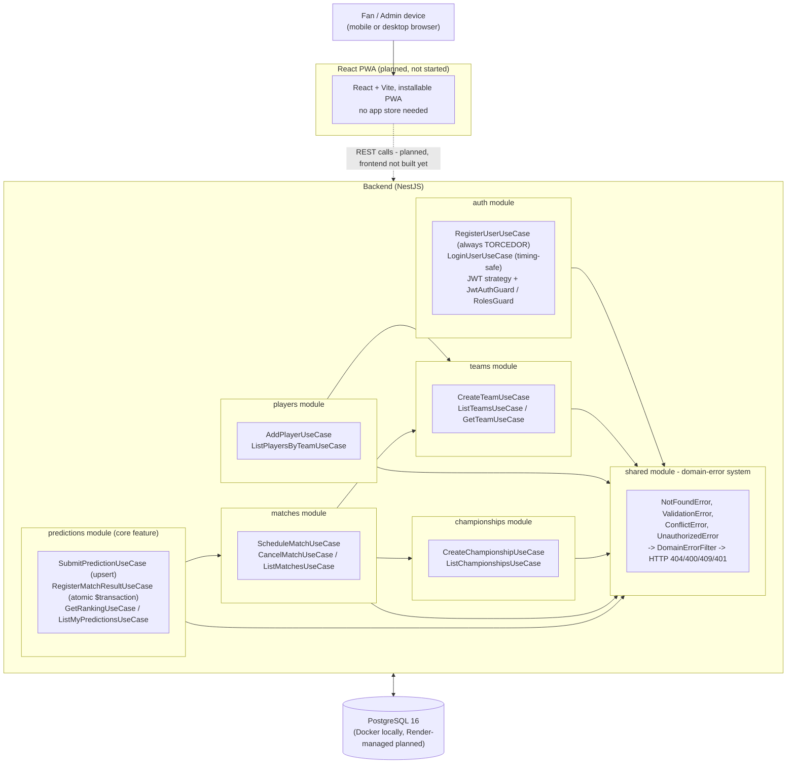

# Architecture

**The scoring rule and atomic match-result registration (the `predictions` module in the diagram
below) are the project's flagship mechanic** — every other module (auth, teams, players,
championships, matches) exists to get real, validated match data safely into that mechanic. See
"Key decisions" below.

## System overview



## Current implementation status

| Component | Status | Notes |
|-----------|--------|-------|
| Frontend (React + Vite PWA) | ⛔ NOT STARTED | Planned as a separate phase; no frontend code exists yet |
| Backend (NestJS, overall) | ✅ DONE | 6 feature modules + one shared cross-cutting module, all following the same Clean Architecture shape |
| — auth module | ✅ DONE | Register (always assigns `TORCEDOR`, no `role` field on input), timing-safe login, JWT strategy + `JwtAuthGuard`/`RolesGuard` reused by every other module |
| — teams module | ✅ DONE | Create/list/get team; rejects blank names; exports `TEAM_REPOSITORY` for players and matches to validate a team exists |
| — players module | ✅ DONE | Add player (confirms team exists first), list players by team; nested route `POST /teams/:teamId/players` |
| — championships module | ✅ DONE | Create (validates `endDate > startDate`), list; format enum `PONTOS_CORRIDOS \| MATA_MATA` |
| — matches module | ✅ DONE | Schedule (same-team/championship/home/away checks in cheapest-first order), cancel (blocks already-`FINALIZADA`), list with optional `teamId`/`championshipId`/`status` filters |
| — predictions module (core feature) | ✅ DONE | Submit (upsert, deadline enforced via injected `Clock`), atomic result registration + scoring in one Prisma `$transaction`, ranking with tie-break, `GET /predictions/me` |
| — shared domain-error system | ✅ DONE | 4 typed error classes + global `DomainErrorFilter`, used consistently by every module |
| Database (PostgreSQL 16 + Prisma 7.9.1) | ✅ DONE (local) | 6 tables / 3 enums modeled and migrated locally via Docker; Render-managed instance planned for production |
| Tests (Jest, TDD) | ✅ DONE | 12 suites / 32 tests passing as of the last commit |
| Deploy (Render) | ⛔ NOT STARTED | Web Service (free tier) + Render-managed PostgreSQL planned; correct root directory/build/start commands already identified, but no deploy attempted yet |

## Backend architecture (Clean Architecture)

Every one of the 6 feature modules follows the same 4-folder shape:

```
backend/src/<module>/
  domain/         # Pure TypeScript types + repository interfaces. Zero NestJS/Prisma imports.
  use-cases/      # Plain TS classes, one per business action. Unit-tested with mocked repositories.
  data/           # Prisma<X>Repository implementations. Only these files import PrismaService.
  presentation/   # NestJS controllers, DTOs, guards. Wires a use-case to an HTTP route.
```

Plus a `shared/` module (not a feature, cross-cutting):

```
backend/src/shared/
  domain/errors.ts              # NotFoundError, ValidationError, ConflictError, UnauthorizedError
  domain/clock.interface.ts     # Clock interface (now() -> Date), for testable deadline logic
  data/system-clock.ts          # SystemClock implements Clock
  presentation/domain-error.filter.ts  # Global NestJS exception filter mapping the 4 error
                                        # classes above to 404/400/409/401 automatically
```

Controllers instantiate use-cases directly (`new CreateTeamUseCase(this.teamRepository)`) rather
than registering them with NestJS's DI container — this is a consistent, deliberate pattern across
every controller in the codebase, not an inconsistency to fix.

## Data flow

```
Presentation (controllers, DTOs, guards)
    ↓ calls
Use-cases (one plain TS class per business action)
    ↓ uses
Domain (pure types, repository interfaces, scoring.ts)
    ↓ reads/writes via
Data (Prisma<X>Repository implementations)
    ↓
PostgreSQL
```

### Match-result registration flow (specific)

```
POST /matches/:id/result
    ↓ RegisterMatchResultUseCase
    ├─ validates: match exists → not already FINALIZADA → not CANCELADA → scores not negative
    ↓ calculatePredictionPoints(guess, result) computed for every prediction on the match
    ↓ registerResultAndScorePredictions(matchId, result, scoredPredictions)
PrismaMatchRepository — single Prisma $transaction
    ├─ updates Match.status -> FINALIZADA, homeScore, awayScore
    └─ updates every Prediction.pointsEarned
    (all-or-nothing: a crash partway through leaves nothing partially scored)
```

## Key decisions

0. **No real money ever moves through the app — this is the product's defining constraint, not an
   afterthought.** This was a deliberate pivot away from an earlier real-money betting concept,
   because Brazilian law (Lei 14.790/2023) requires SPA/MF authorization for real-money fixed-odds
   betting, with capital requirements (R$30M capital social, R$30M outorga, R$5M reserve) far out of
   reach for an indie project. Any real prize a group wants is arranged entirely outside the app.
   Every other architectural choice below sits inside this constraint (see
   [legal-compliance.md](legal-compliance.md)).

1. **Clean Architecture layering across all 6 modules and the shared module** (see
   [coding-standards.md](coding-standards.md)): domain logic (the scoring rule, repository
   interfaces) has zero dependency on NestJS decorators or Prisma — it's plain, testable
   TypeScript. `calculatePredictionPoints(guess, result)` in
   `backend/src/predictions/domain/scoring.ts` is the clearest example: a pure function, fully
   unit-testable in isolation, with the exact-score check running before the outcome-comparison
   fallback.

2. **Atomic transactions for match-result registration.** Registering a result used to write the
   match update and then loop point updates per prediction — a crash partway through could leave a
   match permanently `FINALIZADA` with only some predictions scored, since the `FINALIZADA` guard
   then blocked any retry. Fixed with `registerResultAndScorePredictions`, implemented via Prisma's
   array-form `$transaction`, so the match update and every prediction's point update happen in one
   atomic database transaction.

3. **A shared domain-error system, not per-controller try/catch.** Early on, use cases threw plain
   `Error` for expected business failures ("Team not found"), which NestJS translates to a generic,
   misleading `500` by default. Fixed by introducing `NotFoundError`, `ValidationError`,
   `ConflictError`, and `UnauthorizedError` in `shared/`, plus a global `DomainErrorFilter` that maps
   each to the right HTTP status (404/400/409/401) automatically, with zero per-controller
   try/catch needed. Every module built after this point uses the pattern; the earliest module
   (auth) originally hand-rolled its own translation and was brought in line with the rest in a
   later review pass.

4. **Controllers instantiate use-cases directly**, rather than registering them with NestJS's DI
   container — a consistent, deliberate pattern across the whole codebase.

5. **A fail-fast, no-silent-defaults security posture.** If `JWT_SECRET` is unset, the app now
   throws at boot instead of silently falling back to a hardcoded default — a misconfigured
   production deploy failing loudly beats one that boots normally and signs tokens with a secret
   anyone could read. Login also always runs a real `bcrypt.compare()`, using a fixed dummy hash
   when the user isn't found, so an unknown email and a wrong password take comparable time and
   can't be distinguished by response latency.

6. **Prisma 7's schema-first requirements were accepted, not worked around.** The database is
   central to what this app does (persisted teams, matches, and predictions), so the ORM's
   version-7 requirements — an explicit `output` path for the generated client, `moduleFormat:
   "cjs"` (Prisma 7 defaults to ESM, NestJS compiles to CommonJS), an explicit `PrismaPg` driver
   adapter, and `DATABASE_URL` living only in `prisma.config.ts` rather than `schema.prisma` — were
   treated as the real, current shape of the tool rather than something to route around.

7. **CR, not full CRUD, is a deliberate MVP scope boundary.** There are no update/delete endpoints
   for teams, players, championships, or matches yet. This is a stated scope decision for the
   current phase, not an oversight.

## Related flows

- [Prediction flow](flowcharts/prediction-flow.md) — submission through the kickoff deadline to
  atomic scoring on match-result registration
