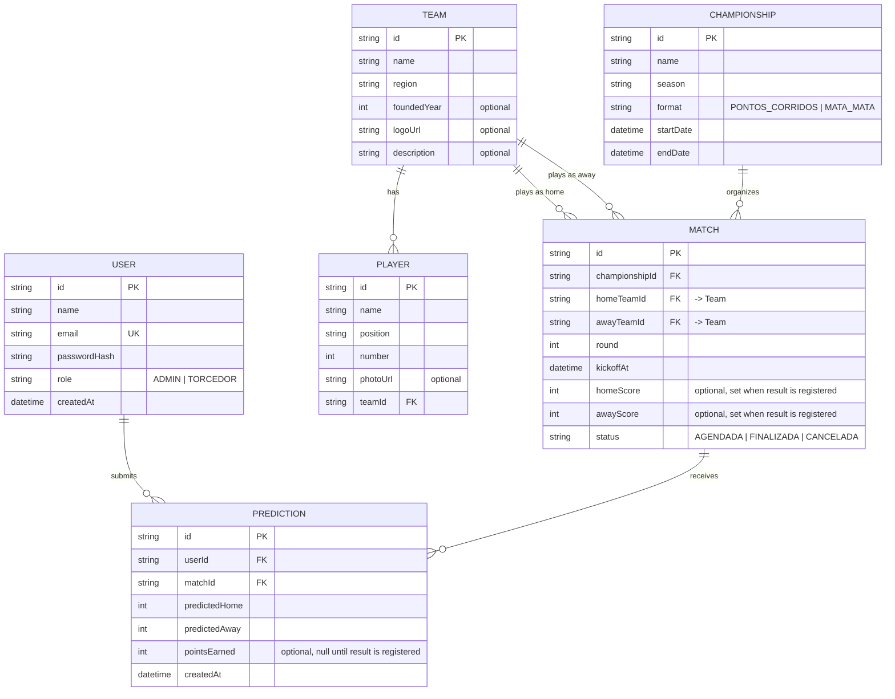

# Entity-Relationship Diagram

Covers the 6 Prisma tables that back the backend. Unlike a client-only or offline-first app, VZBet's
whole point is a shared, persisted prediction pool, so every entity a fan or admin interacts with —
users, teams, players, championships, matches, predictions — is modeled here; there is no
client-only data model to exclude.

## Notes

- **`MATCH` has two relations to `TEAM`** (`homeTeamId` and `awayTeamId`), both pointing at the same
  model. Prisma can't infer which foreign key maps to which relation field when a model references
  another model twice, so the schema disambiguates them with named relations —
  `@relation("HomeTeam")` on the home side and `@relation("AwayTeam")` on the away side. Without
  those names, Prisma has no way to tell the two foreign keys apart.
- **`@@unique([userId, matchId])` on `PREDICTION`** enforces "one prediction per fan per match" at
  the database level. It's also what makes editing a prediction possible without a separate update
  endpoint: `SubmitPredictionUseCase` upserts on that composite key, so a fan resubmitting before
  kickoff overwrites their existing row instead of creating a duplicate.
- **`pointsEarned` is nullable** because a prediction starts unscored — it's only filled in once
  `RegisterMatchResultUseCase` runs, which writes the match result and every associated prediction's
  score together in a single atomic transaction. A prediction tied to a match that gets cancelled
  instead of finalized never has a result registered against it, so `pointsEarned` stays `null`
  permanently in that case.
- **There is currently no update or delete endpoint for any of these entities** — the API is "CR"
  (create + read) only, not full CRUD. This is a deliberate MVP scope decision, not an oversight.
  The two exceptions that look like updates from the schema's perspective — match cancellation and
  match-result registration, both of which mutate a `MATCH` row's `status` (and, for results,
  `homeScore`/`awayScore`) — are purpose-built action endpoints (`POST /matches/:id/cancel`,
  `POST /matches/:id/result`), not a generic `PATCH /matches/:id`.
