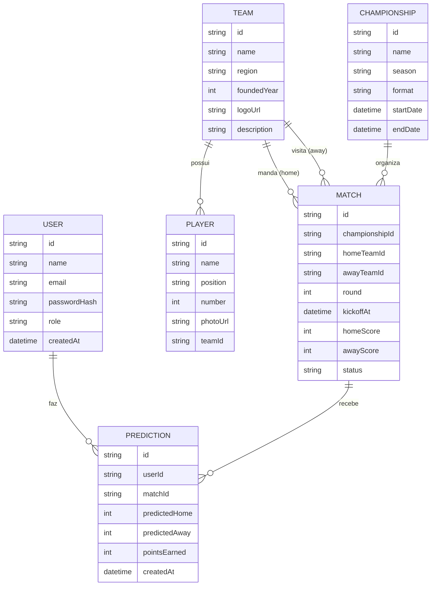

# Diagrama ER

```mermaid
erDiagram
    USER ||--o{ PREDICTION : faz
    TEAM ||--o{ PLAYER : possui
    TEAM ||--o{ MATCH : "manda (home)"
    TEAM ||--o{ MATCH : "visita (away)"
    CHAMPIONSHIP ||--o{ MATCH : organiza
    MATCH ||--o{ PREDICTION : recebe

    USER {
        string id
        string name
        string email
        string passwordHash
        string role
        datetime createdAt
    }
    TEAM {
        string id
        string name
        string region
        int foundedYear
        string logoUrl
        string description
    }
    PLAYER {
        string id
        string name
        string position
        int number
        string photoUrl
        string teamId
    }
    CHAMPIONSHIP {
        string id
        string name
        string season
        string format
        datetime startDate
        datetime endDate
    }
    MATCH {
        string id
        string championshipId
        string homeTeamId
        string awayTeamId
        int round
        datetime kickoffAt
        int homeScore
        int awayScore
        string status
    }
    PREDICTION {
        string id
        string userId
        string matchId
        int predictedHome
        int predictedAway
        int pointsEarned
        datetime createdAt
    }
```
