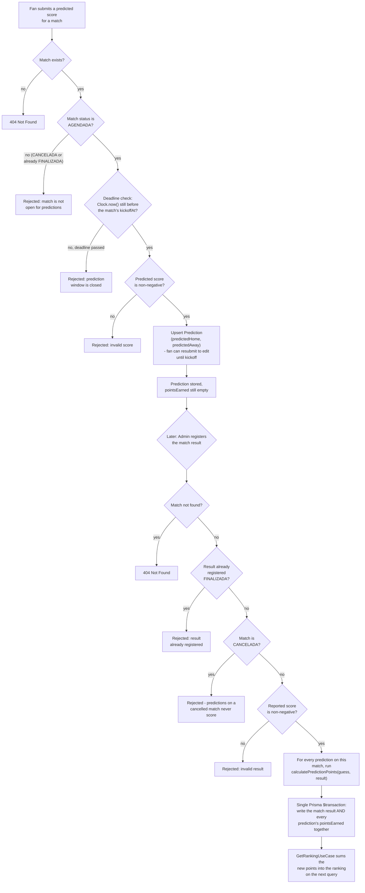

# Prediction Flow (core feature)

Covers the fan prediction and admin result-registration use cases described in
[../use-cases.md](../use-cases.md). This is the project's core flow — see
[../architecture.md](../architecture.md) for the Clean Architecture layering (`domain` /
`use-cases` / `data` / `presentation`) that the `predictions` module follows.

## Why match-result registration is atomic

An earlier version of `RegisterMatchResultUseCase` wrote the match result first, then looped over
each prediction calling an `updatePoints()` method one at a time. That left a window where a crash
or database error partway through scoring could leave the match marked `FINALIZADA` with only some
predictions scored — and because the use case's own guard blocked re-registering a result for an
already-`FINALIZADA` match, that partial state was permanently stuck, with no safe way to retry.
The fix replaced the loop with a single repository method,
`registerResultAndScorePredictions(matchId, result, scoredPredictions)`, built on Prisma's
array-form `$transaction`: the match update and every prediction's point update now commit — or
fail — together, so the ranking can never reflect a match that is "half scored."

The same review also tightened the cancelled-match guard itself: the check used to only look for
`status === 'FINALIZADA'`, which meant a cancelled match's predictions could still slip through and
get scored. The guard now rejects registration for any match whose status isn't `AGENDADA`, so a
`CANCELADA` match's predictions are guaranteed to never earn points, matching the scoring rule's own
stated behavior.

## Why the deadline check uses an injectable Clock instead of `new Date()`

`SubmitPredictionUseCase` doesn't call `new Date()` to compare against a match's `kickoffAt`. It
depends on a small `Clock` interface (`now(): Date`, defined in
`backend/src/shared/domain/clock.interface.ts`), with `SystemClock` — the real, wall-clock-backed
implementation — wired in only at the `presentation` layer for production use. Calling `new Date()`
directly inside the use case would work the same way in production, but it would make the deadline
logic itself untestable without either waiting on real time to pass or monkeypatching the global
`Date` object. With the time source injected, a unit test can hand the use case a fake `Clock` that
returns whatever instant it likes, and assert deterministically that a prediction submitted one
second before kickoff succeeds and one submitted one second after is rejected — no sleeping, no
flaky timing-dependent tests, no touching global state.
